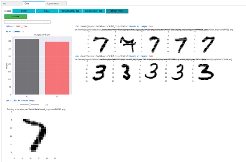

### fastGUI

- GUI using [fastai2](https://github.com/fastai/fastai2), [voila](https://github.com/voila-dashboards/voila)  and [binder](https://mybinder.org/)
 
- Under the 'Info' tab you can now easily upload some common datasets: Cats&Dogs, Imagenette, Imagewoof, Cifar and Mnist

  

